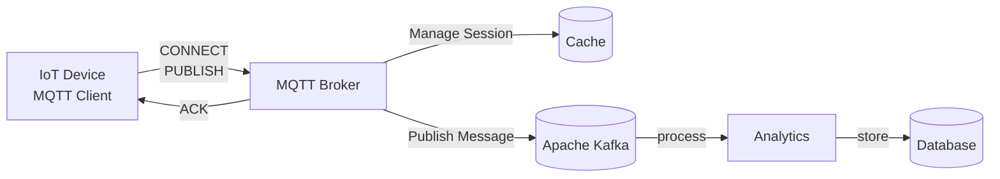

# MQTT Platform

```mermaid
flowchart LR
    D[IoT Device<br/>MQTT Client]
    B[MQTT Broker]
    C[(Cache)]
    K[(Apache Kafka)]
    AL[Analytics]
    DB[(Database)]

    D -->|CONNECT <br/> PUBLISH| B
    B -->|ACK| D
    
    B -->|Manage Session| C
    
    B -->|Publish Message| K

    K -->|process| AL

    AL -->|store| DB
```
